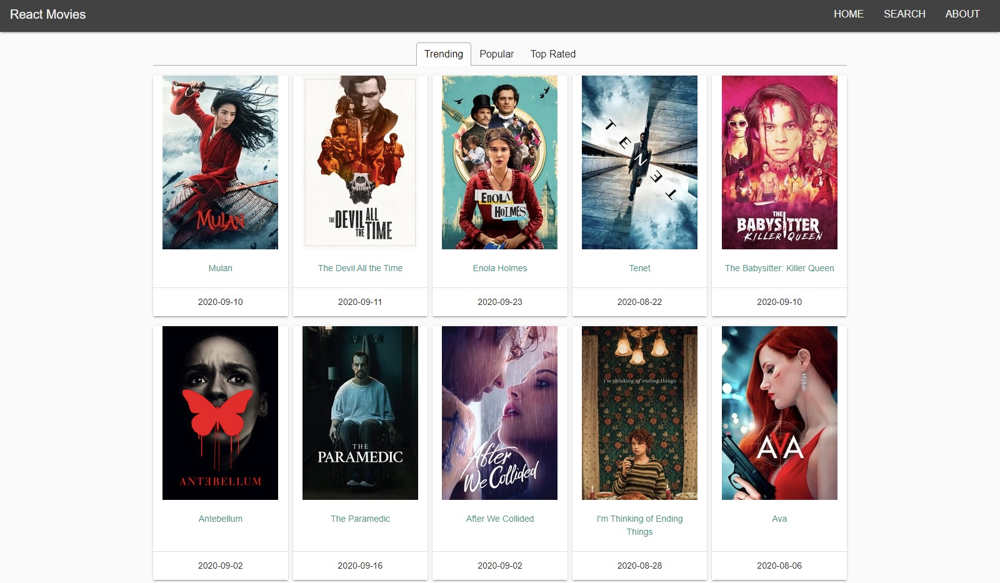
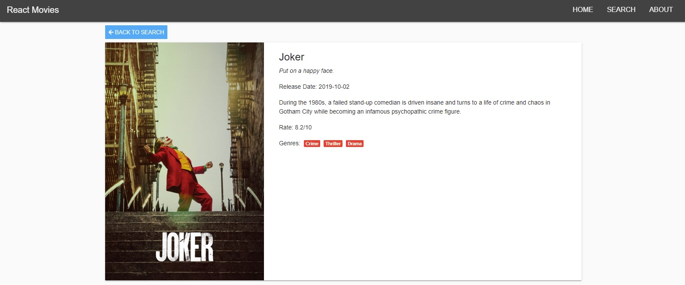
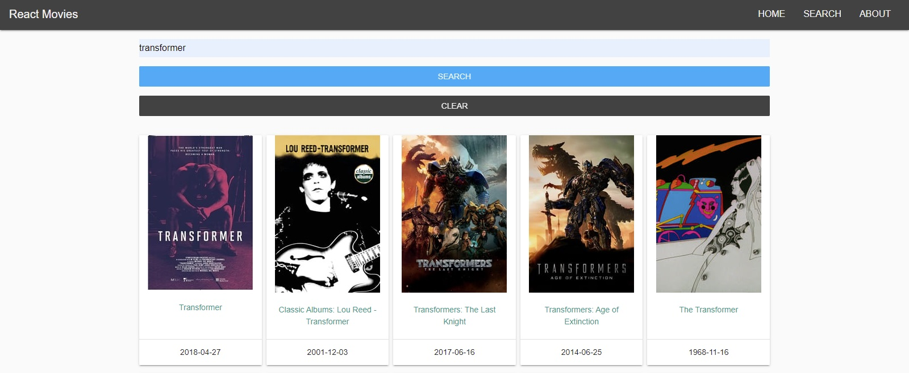

# React Movie Finder

## Description:

Movie Finder Web App built with React using TMDB API

## Tools & Languages:

- React
- React Router
- React Tabs
- React Context API
- React Hooks
- TheMovieDB API
- Axios
- Bootstrap Material Design
- Node Sass

## Todo List

- [ ] Add paginations
- [ ] Implement infinite scrolling

## Screenshots:

### Home Page

### Movie Details

### Search Movies

### <a href="https://reactmoviefinder.netlify.app/">Live Demo</a>

## Fork

Anyone can improve upon this project and add other features, so feel free to fork.

## License

This project is open-source and under the <a href="https://opensource.org/licenses/MIT">MIT Licence</a>
